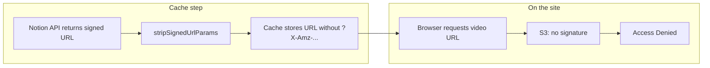

# Fix Notion video on website

## What’s going wrong

You see two things:

1. **Video appears as a link** – The post body shows a blue link like `cursorful-video-1771946032017.mp4` instead of an embedded player.
2. **Access Denied when loading the video** – When the browser requests that URL (or a `<video src="...">` with it), the server returns an XML error: `AccessDenied`.

**Cause:**

- Notion stores uploads on S3 and gives **temporary signed URLs** (with `?X-Amz-Algorithm=...&X-Amz-Signature=...`).
- Your cache script intentionally **strips those query params** before writing to [posts-cache.json](posts-cache.json) so that AWS credentials are never stored (see [.cursor/plans/fix_cache_secrets_and_vercel_build_7a48d4ed.plan.md](.cursor/plans/fix_cache_secrets_and_vercel_build_7a48d4ed.plan.md) and [src/lib/url-utils.ts](src/lib/url-utils.ts)).
- After stripping, the cached URL is just the base S3 URL with no signature. S3 **requires** the signature to serve the file, so requests from the browser get **Access Denied**.
- So: the link you see points to a URL that no longer has permission to serve the file.

## What to change

### 1. Render video links as a player (required)

Right now markdown links to `.mp4` (and similar) are rendered as normal `<a>` links. Add logic so that links whose `href` is a video URL are rendered as a `<video>` element instead.

- **Where:** [src/components/mdx-component.tsx](src/components/mdx-component.tsx), in the custom `components` passed to ReactMarkdown (used by [src/app/posts/[slug]/page.tsx](src/app/posts/[slug]/page.tsx)).
- **How:** In the `a` component, if `href` looks like a video file (e.g. path ends with `.mp4`, `.webm`, `.mov`, etc.), render a `<video controls src={href} ... />` inside a wrapper div (e.g. with `aspect-video` and rounded corners). Otherwise keep rendering a normal `<a>`.

Result: the video will appear as an embedded player instead of a link. It will still fail to load until the URL issue is fixed (step 2).

### 2. Make the video URL work (choose one approach)

**Option A – Quick fix: do not strip signatures for video URLs (simple, but temporary)**

- **Where:** [scripts/cache-posts.ts](scripts/cache-posts.ts) and [src/lib/url-utils.ts](src/lib/url-utils.ts).
- **How:** When sanitizing `content` (and optionally `description`), only strip signed params from URLs that are **not** video files. For example, add a helper that detects video extensions in the URL path (e.g. `.mp4`, `.webm`, `.mov`) and leaves those URLs unchanged; strip all others.
- **Result:** Cached video URLs keep their `?X-Amz-...` params, so the video will load when the user opens the post. **Caveat:** Notion’s signed URLs usually expire (often within an hour or so). After expiry, the same Access Denied will come back until you run `npm run cache:posts` again to get a fresh signed URL. So this is “works for a while after each cache refresh.”

**Option B – Robust fix: proxy via API so URLs are never cached (no secrets, works after expiry)**

- **Idea:** Do **not** store any signed video URL in the cache. At **request time**, when rendering a post that contains a Notion video, resolve the video URL through your backend and let the browser load it from there.
- **Flow:**
  1. **Cache:** When saving post content, replace each Notion S3 video URL (e.g. `https://prod-files-secure.s3.../.../file.mp4` with or without query params) with a stable placeholder that encodes “post X, video index Y”, e.g. a link to your API: `https://yoursite.com/api/notion-media?postId=...&index=0`, or a custom syntax that you replace during render.
  2. **Render:** When rendering the post (e.g. in the post page or in the component that outputs the video), replace that placeholder/link with either (a) a `<video src="/api/notion-media?postId=...&index=0">` or (b) a link that redirects to the actual video URL.
  3. **API route:** Add `app/api/notion-media/route.ts` (or similar). It receives `postId` and `index`. It uses the Notion client to fetch that page’s blocks, finds the Nth video block, reads its current `url` (Notion returns a fresh signed URL), and either **redirects** (302) to that URL or **streams** the response from that URL. The browser then loads the video from your API, which in turn uses a fresh signed URL each time.
- **Result:** No signed URLs in the cache; videos keep working even after the original signature expires; same approach can be extended later for images if desired.

**Option C – Host videos elsewhere (no code change)**

- Upload the video to a public host (e.g. YouTube, Vimeo, Vercel Blob, or a public S3/R2 bucket) and embed **that** URL in the Notion post (embed block or link). The cached content will then contain a public URL that doesn’t depend on Notion’s S3 signatures, so it will work without any proxy or special handling. This is a content/workflow change only.

---

## Recommended order

1. **Implement step 1** so the video at least appears as a player on the page.
2. **Choose one of 2A, 2B, or 2C:**
  - **2A** if you want the smallest code change and are okay re-running cache (or redeploying) when the video link expires.
  - **2B** if you want videos to work long-term without storing secrets and without re-caching.
  - **2C** if you prefer to keep videos outside Notion and avoid backend changes.

## Files to touch (by option)

| Step / Option               | File(s)                                                                                                                                                                                                                                             |
| --------------------------- | --------------------------------------------------------------------------------------------------------------------------------------------------------------------------------------------------------------------------------------------------- |
| 1 – Video as player         | [src/components/mdx-component.tsx](src/components/mdx-component.tsx)                                                                                                                                                                                |
| 2A – Don’t strip video URLs | [src/lib/url-utils.ts](src/lib/url-utils.ts) (e.g. `stripSignedUrlParams` only strip when URL is not a video), [scripts/cache-posts.ts](scripts/cache-posts.ts) only if you need a different entry point                                            |
| 2B – API proxy              | New `src/app/api/notion-media/route.ts`; [src/lib/url-utils.ts](src/lib/url-utils.ts) or cache script to replace Notion video URLs with API placeholder; post render or mdx-component to use `/api/notion-media?postId=...&index=0` for video `src` |

